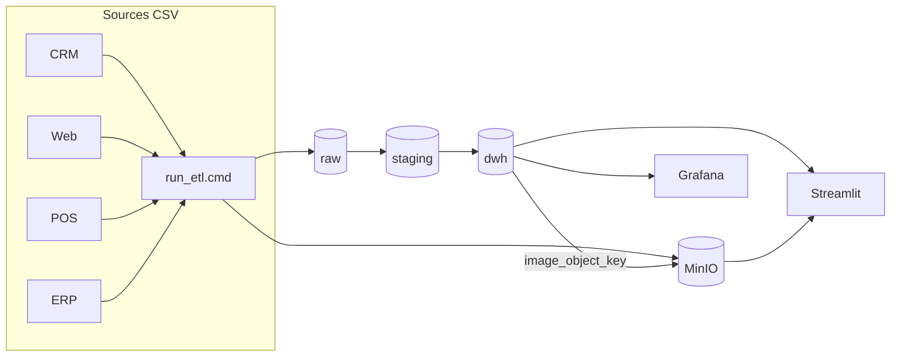
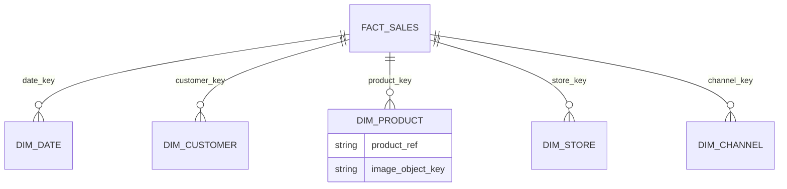

# UNICLOTHES - Architecture de donnees

## Demarrage

Copiez le fichier d'environnement, puis lancez la stack Docker depuis le dossier `docker`.

```powershell
cd docker
copy .env.example .env
docker compose up -d --build
```

Le premier demarrage prend deux a trois minutes le temps de telecharger les images et d'initialiser PostgreSQL.

Chargez ensuite les donnees avec le pipeline ETL.

```powershell
cd ..\scripts
.\run_etl.cmd
```

Si PowerShell bloque les scripts `.ps1`, utilisez `run_etl.cmd` ou lancez `powershell -ExecutionPolicy Bypass -File .\run_etl.ps1`. A l'issue du traitement, le schema `dwh` contient environ 2 200 lignes de ventes, 560 clients consolides et les images produit dans MinIO.

Apres toute modification du code Streamlit ou de ses dependances Python, reconstruisez le conteneur.

```powershell
cd docker
docker compose up -d --build streamlit
```

---

## Services

| Service | URL | Identifiants |
|---------|-----|--------------|
| Streamlit (BI) | http://localhost:8501 | — |
| Grafana (monitoring) | http://localhost:3001 | `admin` / `uniclothes_grafana` |
| MinIO (objets) | http://localhost:9001 | `uniclothes_minio` / `uniclothes_minio_2026` |
| PostgreSQL | localhost:5432 | `uniclothes` / `uniclothes_dev_2026` |
| Prometheus | http://localhost:9090 | — |

Streamlit couvre la BI metier (KPIs, ventes, boutiques, catalogue produit, qualite data). Grafana surveille uniquement l'infrastructure.

---

## Architecture

Les sources simulees (CRM, web, caisses, ERP) alimentent PostgreSQL selon le modele medallion : la zone `raw` accueille les CSV bruts, `staging` applique le golden record client et produit, `dwh` heberge le star schema. MinIO stocke les images ; PostgreSQL porte la reference via `dim_product.image_object_key`, au format `{product_ref}.jpg`. L'ETL uploade les fichiers a l'etape 5 ; Streamlit les recupere via `http://minio:9000` sur le reseau Docker.





Les diagrammes detailles se trouvent dans `docs/architecture-globale.drawio`, `docs/erd-conceptuel.drawio` et `docs/star-schema.drawio`.

---

## Demo RGPD

Le script `scripts/demo_rgpd.ps1` illustre l'export et l'effacement d'un client, ainsi que le journal d'audit.

```powershell
cd scripts
.\demo_rgpd.ps1
```

---

## Terraform

```powershell
cd terraform
terraform init
terraform apply
cd ..\scripts
.\run_etl.cmd
terraform output
```
