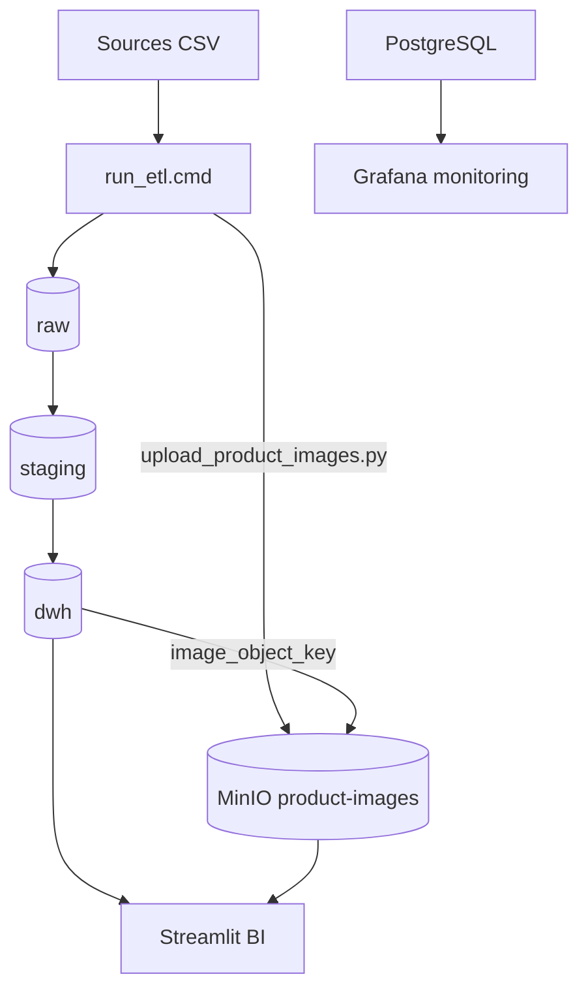

# Architecture de donnees UNICLOTHES — Documentation technique

## 1. Vue d'ensemble

Plateforme data **Phase 1** implementant le plan de gouvernance (Bloc 1) :
- Golden record client omnicanal
- Referentiel produit ERP
- Star schema analytique
- Portail BI Streamlit
- Monitoring Grafana/Prometheus
- Stockage objets MinIO
- Conformite RGPD

**Hebergement :** Docker Compose local (ARM64 compatible).

## 2. Diagramme logique

**Fichier Draw.io :** [architecture-globale.drawio](architecture-globale.drawio)

## 3. Conteneurs Docker (7 services)

| Service | Image | Port | Role |
|---------|-------|------|------|
| uniclothes-postgres | postgres:16-alpine | 5432 | Moteur data medallion |
| uniclothes-streamlit | build local | 8501 | Portail BI |
| uniclothes-grafana | grafana:11.2.0 | 3001 | Monitoring infra |
| uniclothes-prometheus | prom/prometheus | 9090 | Collecte metriques |
| uniclothes-postgres-exporter | postgres-exporter | — | Metriques PG |
| uniclothes-minio | minio/minio | 9001 | Console objets |
| uniclothes-minio-init | minio/mc | — | Init bucket (once) |

## 4. Couches de donnees

### 4.1 Raw (landing zone)

Tables miroir sans transformation :
- `raw.customers_crm`, `raw.customers_web`, `raw.customers_pos`
- `raw.products_erp`, `raw.products_web`
- `raw.orders_web`, `raw.orders_pos`
- `raw.stores`

### 4.2 Staging

| Table | Role |
|-------|------|
| customers_unified | Union 3 sources client |
| customers_golden | Golden record (email normalise) |
| products_golden | Referentiel ERP |
| orders_unified | Commandes web + POS |
| quality_metrics | KPIs gouvernance |

**Regles golden record client :**
1. `LOWER(TRIM(email))`
2. Priorite : CRM (1) > Web (2) > POS (3)
3. Tie-break : `last_activity` la plus recente

### 4.3 DWH (star schema)

**Fait :** `dwh.fact_sales`

**Dimensions :** `dim_customer`, `dim_product` (+ `image_object_key`, `image_url`), `dim_store`, `dim_channel`, `dim_date`

**Vue :** `dwh.v_sales_analytics` (jointure faits + dims, PII via vue anonymisee)

**Diagramme :** [star-schema.drawio](star-schema.drawio)

## 5. Portail BI Streamlit

| Page | Fichier | Requetes principales |
|------|---------|---------------------|
| Accueil | app.py | KPIs globaux |
| Vue executive | pages/1_Vue_executive.py | CA mensuel (area), commandes (barres), donut canal |
| Ventes omnicanal | pages/2_Ventes_omnicanal.py | v_sales_analytics (barres, treemap, funnel) |
| Performance boutiques | pages/3_Performance_boutiques.py | dim_store + facts |
| Collection produits | pages/4_Collection_produits.py | dim_product + **catalogue visuel MinIO** |
| Qualite & UNICLUB | pages/5_Qualite_data_UNICLUB.py | quality_metrics (+ products_with_image_pct) |

**Connexion :** `DATABASE_URL` → PostgreSQL via SQLAlchemy. Images servies via `MINIO_PUBLIC_URL` (defaut `http://localhost:9000`).

## 5b. Liaison MinIO (niveau 1)

| Element | Valeur |
|---------|--------|
| Bucket | `product-images` |
| Cle objet | `{product_ref}.jpg` |
| Colonne DWH | `dim_product.image_object_key` |
| Script upload | `scripts/ingest/upload_product_images.py` |
| KPI | `products_with_image_pct` dans `staging.quality_metrics` |

## 6. Securite & RGPD

| Mecanisme | Implementation |
|-----------|---------------|
| Moindre privilege | Roles `uniclothes_analyst`, `uniclothes_dpo` |
| Anonymisation BI | `dwh.dim_customer_anonymized` |
| Droit acces | `audit.export_customer_gdpr(email)` |
| Droit effacement | `audit.delete_customer_gdpr(email)` |
| Tracabilite | `audit.gdpr_requests` |

## 7. Monitoring

- **Prometheus** scrape postgres-exporter + minio
- **Grafana** dashboard : `UNICLOTHES - Data Platform Overview`
- **KPIs metier** : Streamlit page Qualite & UNICLUB (pas Grafana)

## 8. Pipeline ETL

Script : `scripts/run_etl.cmd` (Windows) / `run_etl.sh` (Linux)

Ordre d'execution :
1. `00_load_raw_data.sql` — COPY CSV
2. `05_build_star_schema.sql` — staging + dwh (+ migration colonnes image)
3. `06_rgpd_security.sql` — roles + vues
4. `upload_product_images.py` — placeholders → MinIO (etape 5 du script shell)

## 9. Infrastructure as Code

- **Docker Compose :** `docker/docker-compose.yml`
- **Terraform :** `terraform/main.tf` — reseau, volumes, `docker compose up`

## 10. Roadmap Phase 2

1. Migration cloud (RDS, S3, ECS)
2. Catalog OpenMetadata
3. MDM client enterprise
4. Kafka streaming
5. Multi-pays ES/IT

## 11. References

- Plan gouvernance UNICLOTHES (Bloc 1) — Pavel-Dan DIACONU
- RGPD UE 2016/679
- Medallion Architecture (Databricks)
